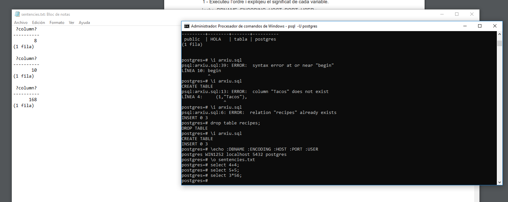

# Postgres
- Coneixeu què és una Plataforma de Servei( Paas) al núvol ? Expliqueu breument el concepte i la utilitat:
  - En aquest model, el proveïdor ofereix la xarxa, els servidors, l'emmagatzematge, aplicacions, repositoris, i en definitiva tot el que calgui per a poder hostetjar les aplicacions i serveis creats per als clients.
- Ens centrarem en la Plataforma Heroku ja que té un pla gratuït que només cal registar-se i és una de les plataformes més utilitzades darrere de AWS i Google App Engine. A més te suport per les bases de dades Postgres. Expliqueu característiques i beneficis de la plataforma Heroku.
  - Permet crear bases de dades compatibles amb postgres.
- Creem la nostra base de dades amb heroku
  
   

-Instal·lem el pgAdmin3 (amb windows ja ve el 4) i connectem la nostra base de dades amb pgAdmin, posant els credencials de la nostra base de dades al pgadmin
 

## Carregar un Fixter sql

- Per què seveix la instrucció \! pwd ? Per que pot ser útil ?
  - Serveix per saber en quin directori estas treballant actualment
-   Executeu l’ordre i expliqeu el significat de cada variable.
-   \echo :DBNAME :ENCODING :HOST :PORT :USER ;
  
  

  Nom de la base de dades, la codificació, el host, el port i l'usuari.

  - Mitjançant ordre \o: indicant la sortida de sentències d’ara endavant. ( tornar a
executar \o per la sortida estandar)

- Especificar formats de sortida amb l’ordre pset. Els formats de sortida són aligned,
unaligned, html i làtex ( especial interès aquests dos darrers).

- Combinar els apartats anteriors. Canviant format de sortida i
sortida.

- Per que serveixen les orders ( des de consola de postgres):
\l: serveix per llistar totes les bases de dades

\d : Ficar només \d i \d nom_taula ( ex: proveidors).L 'ordre \d és útil per
mostrar informació sobre l'SGBD: taules, índexs,

- Creeu una base de dades nova : provaAlmata.

  
- Us podeu conectar des de consola a la nova base de dades.
\c provaAlmata

- Mireu els usuaris : \du. Quin son ? Tenen alguna similitut amb els
vostres usuaris de la vostra base de dades

- Torneu a la vostra base de dades
  

1 – En un entorn Windows ( ja sigui el vostre ordinador o una màquina virtual amb qualsevol
sistema Windows ): Aneu a la secció Downloads i seguiu les instruccions. Un cop instal.lat
connecteu a la vostra Base de Dades Heroku. Mirar les taules i executeu algún script.

I ens connectem a la nostra base de dades heroku
  

Aqui ja pordem veure la nostra base de dades

Creem un script

